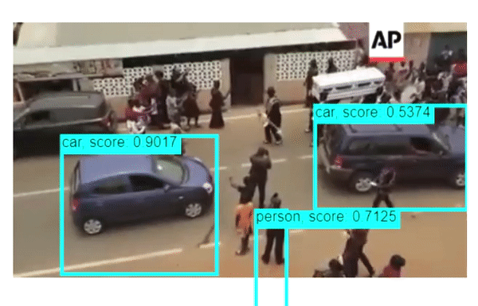
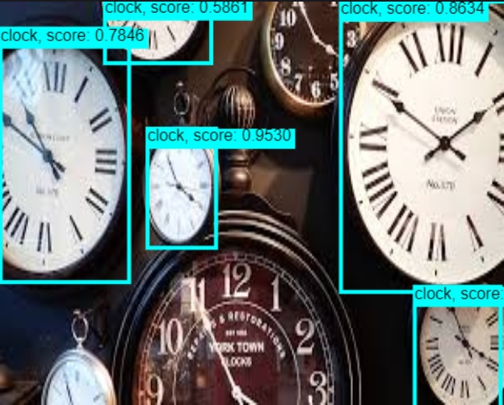

# Object Detection
Object Detection on the browser using Tensorflow.js

You can view the demo [here](https://amurto.github.io/object-detection-browser/).



# Table of Contents

* [Description](https://github.com/amurto/object-detection-browser#description)
* [Dependencies](https://github.com/amurto/object-detection-browser#dependencies)
* [Installation](https://github.com/amurto/object-detection-browser#installation)
  * [Prerequisites](https://github.com/amurto/object-detection-browser#prerequisites)
  * [Instructions](https://github.com/amurto/object-detection-browser#instructions)
* [Usage](https://github.com/amurto/object-detection-browser#usage)
* [License](https://github.com/amurto/object-detection-browser#license)

# Description
    
* The current demo uses the Mobilenetv2-SSD model pretrained on coco weights, which can be found [here](https://github.com/tensorflow/models/tree/master/research/object_detection/models).
* The model was converted into JavaScript supported GraphModels using the [Tensorflowjs Convertor](https://github.com/tensorflow/tfjs/tree/master/tfjs-converter).
* A React web app which can process input images and videos as well as a Realtime feature which uses the device camera to process frames and display the result on a canvas.


### Object Detection


# Dependencies

* [TensorFlow.js](https://www.tensorflow.org/js)
* [Keras](https://keras.io/)
* [npm](https://www.npmjs.com/)
* [React.js](https://reactjs.org/)

# Installation

### Prerequisites

Install Node.js and npm using the link above. Follow instructions on their respecive websites. Npm is included with Node.js

### Instructions

Clone the repository
```bash
git clone https://github.com/amurto/object-detection-browser.git
```

Install all the dependencies
```bash
rmdir docs
rmdir templates
npm install
```

# Usage

After training and converting the model, paste into the public folder along with the labels. Make sure to name the folder "model", which contains the model.json, label.json and the shard files.

Run the project
```bash
npm start
```

Open a web browser and go to
```bash
http://localhost:3000
```

# License

[](https://opensource.org/licenses/MIT)

[MIT License Link](https://github.com/amurto/object-detection-browser/blob/master/LICENSE)